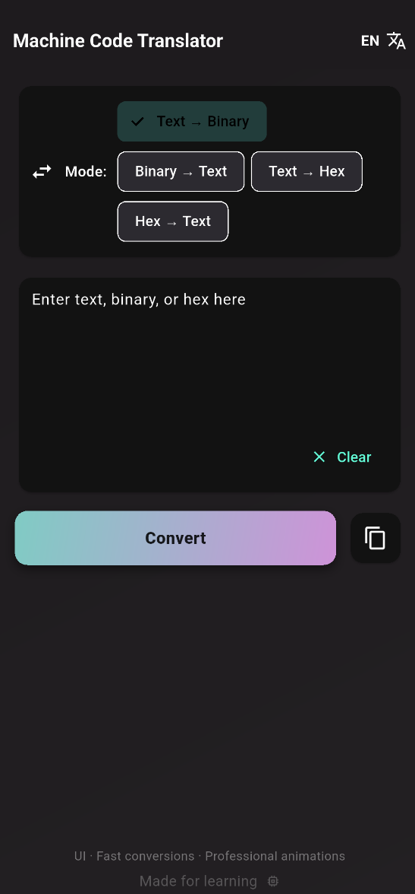
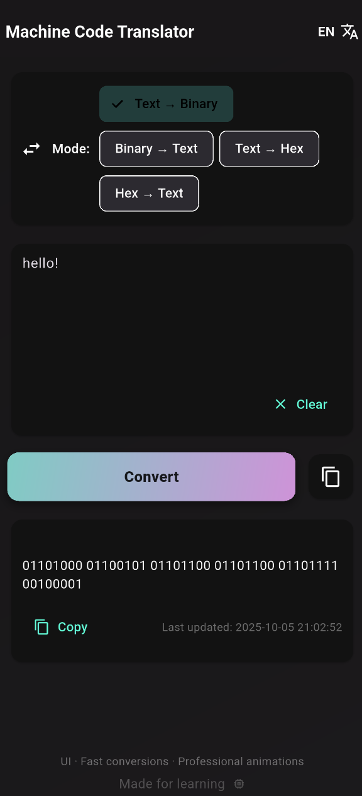

# Machine Code Translator

Machine Code Translator is a Flutter application that allows fast and easy conversion between text, binary, and hexadecimal formats. It features a modern UI, professional animations, and supports both English and Serbian languages.

---

## Features

- Conversion modes:
  - Text → Binary
  - Binary → Text
  - Text → Hex
  - Hex → Text
- Multi-line input support
- Copy output to clipboard
- Animated UI elements and buttons
- Smooth animated background gradient
- Real-time output with professional animations
- Language toggle (English / Serbian)
- Last conversion timestamp display

---

## Installation

1. Clone the repository:

```bash
git clone https://github.com/Luka12-dev/Machine-Code-Translator.git
```

## Install dependencies:

```bash
cd Machine-Code-Translator
flutter pub get
```

## Run the app:

```bash
flutter run
```

---

# For Android release APK:

```bash
flutter build apk --release
```

# For iOS release:

```bash
flutter build ios --release
```

## Usage
+ Select the conversion mode using the “Mode” option.

+ Enter text, binary code, or hex in the input field.

+ Tap Convert to perform the translation.

+ The output will appear in the result card.

+ Tap Copy to copy the result to the clipboard.

## Screenshots



# Technologies
Flutter
Dart

## Material Design

+ Animations with AnimationController, AnimatedBuilder, FadeTransition, and AnimatedSwitcher

## Localization
Supported languages:

+ English

+ Serbian

+ Toggle languages by clicking the EN/SR button in the top-right corner.

## Author
Luka

## License

This project is open-source and free to use or modify.